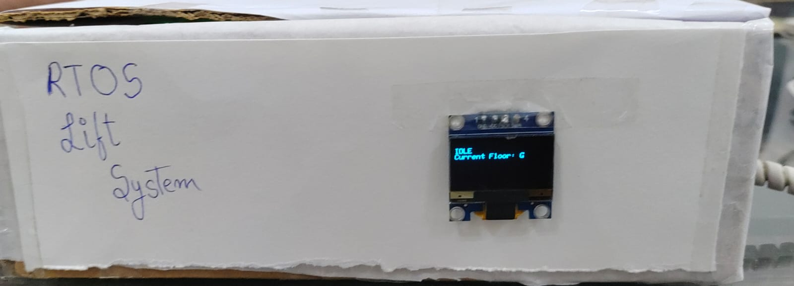
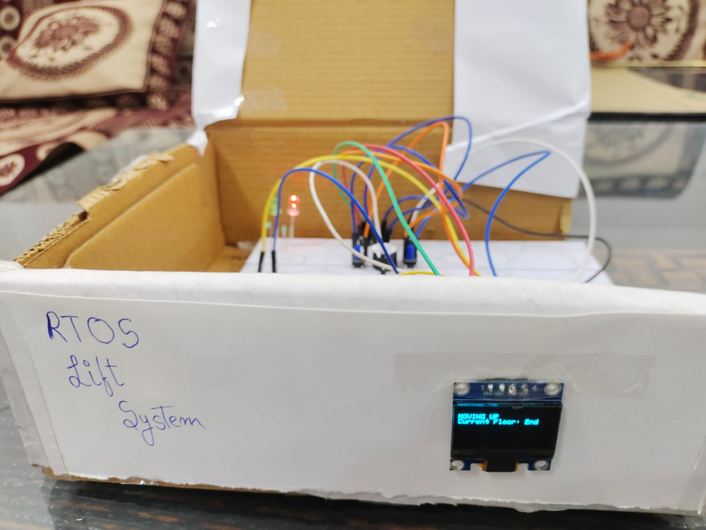
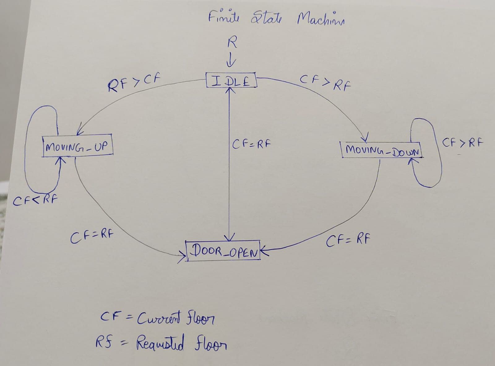

# esp32-RTos-Lift-System
A lift system made with esp32 and FreeRTOS with implementation of finite state machine, directional floor queueing (Lift will not queue upper floor if it is going down), an interrupt based emergency button that can cancel the queue and bring the lift to ground floor and an OLED interface.

[Demo Video](Images/Lift_half_demo.mp4)

# Overview

This project is a 6 floor elevator project aiming to simulate a real lift system as much as possible. The system won't take floor that are below the current floor while going up, the system includes a door open state, if you enter the same floor that the lift is on it will open the door before continuing.

This project was made to learn embedded systems in more detail along side learning task scheduling and FreeRTOS in a trial and error basis.

# Features

- FreeRTOS multitasking
- Finite State Machine
- Floor request queue
- Directionally aware system
- Interrupt based emergency state
- OLED interface displaying State and current floor
- Serial monitor for inputting floors
- LEDs to indicate Status of Idle, Moving and Door opening
- Buzzer to indicate door opening

# Software

- PlatformIO
- VS Code
- Arduino framework
- FreeRTOS

# Hardware

- ESP32 Dev Module.
- Red and Green LED.
- Buzzer.
- Push Button.
- OLED Display 0.96 SSD1306.
- Breadboard and Jumper Wires.

# Finite State Machine

# Elevator States

- IDLE
- MOVING_UP
- MOVING_DOWN
- DOOR_OPEN
- EMERGENCY

# Scheduling Logic 

The schedule follows directional logic, say the requested 2 -> 5 -> 3. Then the queue will first move to 2nd Floor then to 3rd and then to the 5th directionally going up and opening the doors at the requested floors only.

Additionally if at 3rd floor I input floor Ground the lift won't go down and instead go up since the lift is in the state of moving up and won't change the state unless the upper queue is finished.

If the queue is {2,3,2,5}, the lift would still travell in the following direction: 2 -> 3 -> 5 -> 2

# Interrupt 

A physical button has been set up for lift's emergencies that can skip the queue and move directly to the Ground floor and clear the queue.

The interrupt function is "interrupting()" that changes a volatile boolean value (emergency flag).

FreeRTOS can hendle the rest of the task based on the emergency flag and when it is finished the lift clears the emergency flag.

# What I Learnt

- Priority queue management
- RTOS task creation
- Finite State Machine
- Interrupt service Routines
- Embedded software architecture
- Scheduling algorithm
- GPIO programming
- OLED interfacing and I2C communication protocol

[Demo Full Video](Images/Lift_full_demo.mp4)

# Author

Suhaan Tanveer

BTech. Electronics and Communications Engineering

Manipal University Jaipur
